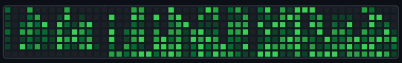

<h1 align="center" style="color:#0ff; font-family: 'Courier New', monospace;">
🎮 Tetris-Style GitHub Contributions
</h1>

  
  

---

> **"Hack your commits into a futuristic grid."**

This project transforms your **GitHub contributions** into a **Tetris-inspired, interactive neon experience**.  
Watch your commits fall like glowing blocks, stack them, and **build your cyberpunk-style contribution skyline!**

---

### 🚀 Features
- Neon-lit **Tetris-like contribution board**
- Interactive and visually striking design
- Perfect for your GitHub README or portfolio

---

⚡ *Stack. Glow. Commit.* ⚡

## 🎮 My GitHub Tetris Contribution Animation

